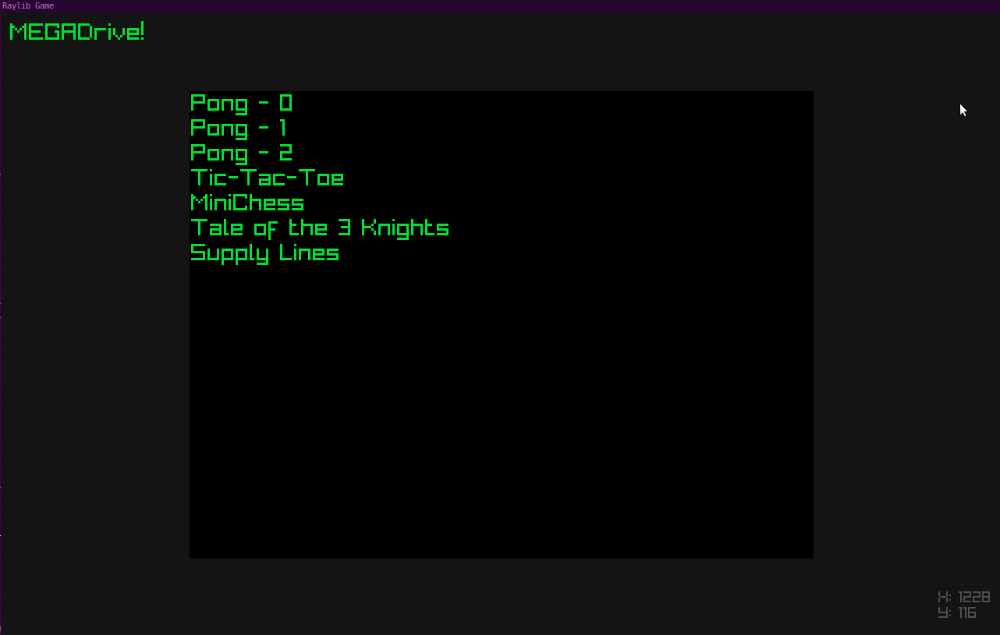

# atlas-t3_hack_sprint


# MegaDrive



## Linkedin

https://www.linkedin.com/in/daveyhaysiii/
https://www.linkedin.com/in/logan-wyatt/

## Description

**Megadrive** is a game launcher for Linux, featuring over 100\* games. It is built using [Raylib](https://www.raylib.com/), a simple and easy-to-use library to create games and graphical applications.

## How to Run

Clone this repo ``` git clone https://github.com/DaveyCHaysIII/atlas-t3_hack_sprint.git ```

To run **Megadrive**, simply execute the following command in your terminal:
```./megadrive```

## Requirements

- Linux-based OS

## Tools Used

-Raylib
-Aseprite
-Famistudio

## Authors

- Davey Hays  - project designer, lead dev and asset designer
- Logan Wyatt - lead dev and project manager

In association with Atlas School of Tulsa

## Todos

- actually get to 100 games!


